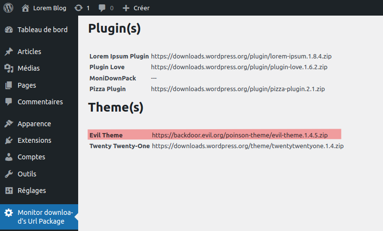

# MoniDownPack-WordPress
This tiny plugin offer a quick view about the url where themes &amp; plugins are downloaded when updates are performed

Juste copy this tree at the root of your Website, enable this plugin on the Wordpress Plugin Manager & Enjoy !

